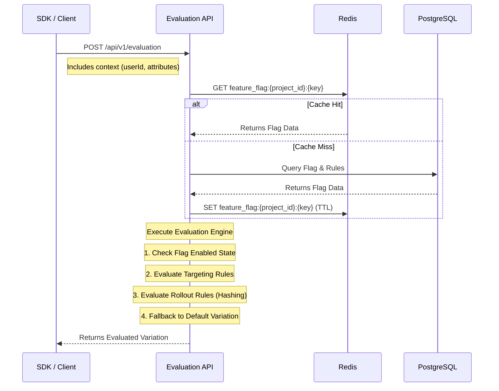

# Flag Evaluation Flow

```mermaid
sequenceDiagram
    participant Client as SDK / Client
    participant API as Evaluation API
    participant Cache as Redis
    participant DB as PostgreSQL

    Client->>API: POST /api/v1/evaluation
    Note right of Client: Includes context (userId, attributes)

    API->>Cache: GET feature_flag:{project_id}:{key}
    
    alt Cache Hit
        Cache-->>API: Returns Flag Data
    else Cache Miss
        API->>DB: Query Flag & Rules
        DB-->>API: Returns Flag Data
        API->>Cache: SET feature_flag:{project_id}:{key} (TTL)
    end

    Note over API: Execute Evaluation Engine
    Note over API: 1. Check Flag Enabled State
    Note over API: 2. Evaluate Targeting Rules
    Note over API: 3. Evaluate Rollout Rules (Hashing)
    Note over API: 4. Fallback to Default Variation

    API-->>Client: Returns Evaluated Variation
```
