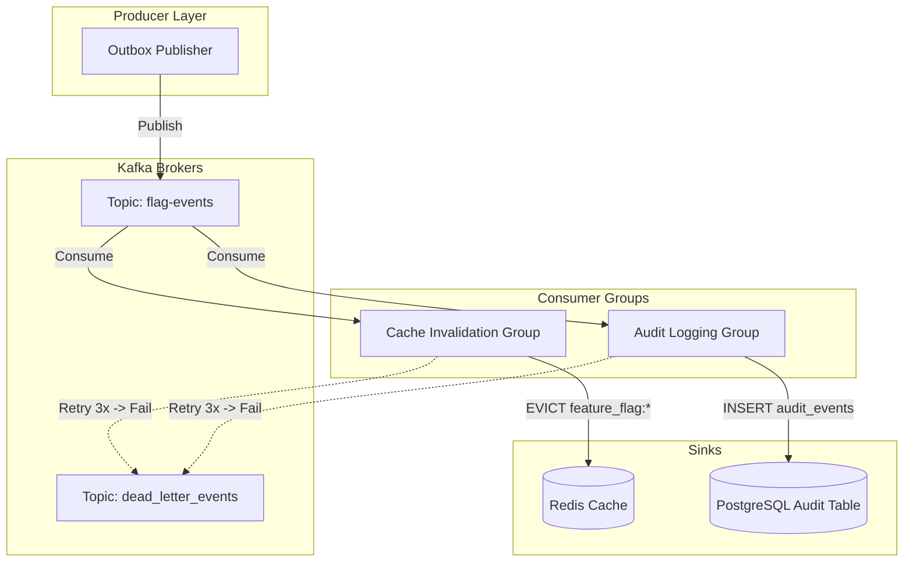

# Kafka Event Flow

```mermaid
graph TD
    subgraph "Producer Layer"
        Outbox[Outbox Publisher]
    end

    subgraph "Kafka Brokers"
        Topic[Topic: flag-events]
        DLQ[Topic: dead_letter_events]
    end

    subgraph "Consumer Groups"
        CG1[Cache Invalidation Group]
        CG2[Audit Logging Group]
    end

    subgraph "Sinks"
        Redis[(Redis Cache)]
        DB[(PostgreSQL Audit Table)]
    end

    Outbox -->|Publish| Topic
    
    Topic -->|Consume| CG1
    Topic -->|Consume| CG2

    CG1 -->|EVICT feature_flag:*| Redis
    CG2 -->|INSERT audit_events| DB

    %% Error Handling
    CG1 -.->|Retry 3x -> Fail| DLQ
    CG2 -.->|Retry 3x -> Fail| DLQ
```
