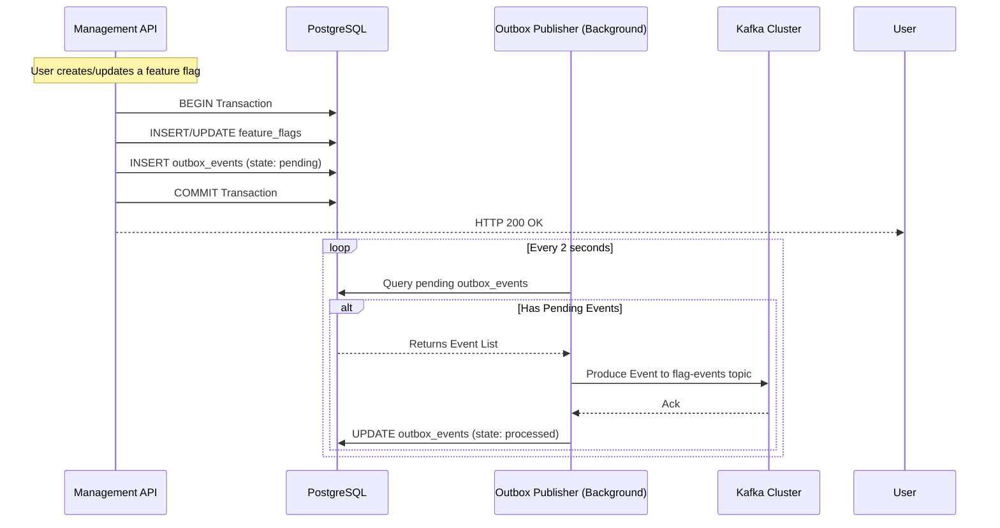

# Outbox Pattern Flow

```mermaid
sequenceDiagram
    participant API as Management API
    participant DB as PostgreSQL
    participant Pub as Outbox Publisher (Background)
    participant Kafka as Kafka Cluster

    Note over API: User creates/updates a feature flag
    API->>DB: BEGIN Transaction
    API->>DB: INSERT/UPDATE feature_flags
    API->>DB: INSERT outbox_events (state: pending)
    API->>DB: COMMIT Transaction
    API-->>User: HTTP 200 OK

    loop Every 2 seconds
        Pub->>DB: Query pending outbox_events
        alt Has Pending Events
            DB-->>Pub: Returns Event List
            Pub->>Kafka: Produce Event to flag-events topic
            Kafka-->>Pub: Ack
            Pub->>DB: UPDATE outbox_events (state: processed)
        end
    end
```
