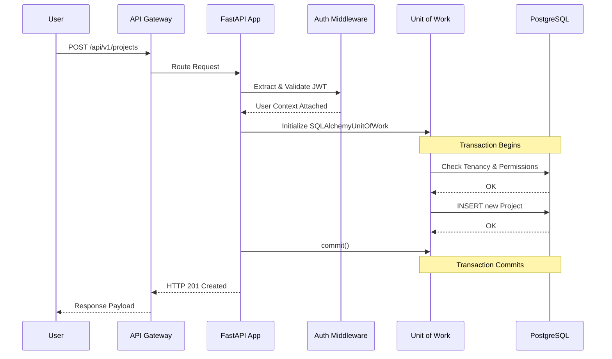

# Standard Request Flow

```mermaid
sequenceDiagram
    participant User
    participant LB as API Gateway
    participant API as FastAPI App
    participant Auth as Auth Middleware
    participant UOW as Unit of Work
    participant DB as PostgreSQL

    User->>LB: POST /api/v1/projects
    LB->>API: Route Request
    
    API->>Auth: Extract & Validate JWT
    Auth-->>API: User Context Attached

    API->>UOW: Initialize SQLAlchemyUnitOfWork
    
    Note over UOW,DB: Transaction Begins
    UOW->>DB: Check Tenancy & Permissions
    DB-->>UOW: OK

    UOW->>DB: INSERT new Project
    DB-->>UOW: OK
    
    API->>UOW: commit()
    Note over UOW,DB: Transaction Commits
    
    API-->>LB: HTTP 201 Created
    LB-->>User: Response Payload
```
