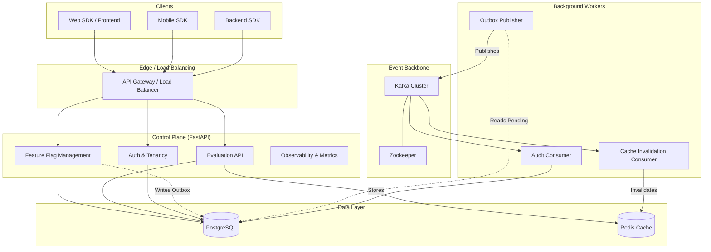

# System Architecture

```mermaid
graph TD
    subgraph "Clients"
        Web[Web SDK / Frontend]
        Mobile[Mobile SDK]
        Backend[Backend SDK]
    end

    subgraph "Edge / Load Balancing"
        Gateway[API Gateway / Load Balancer]
    end

    subgraph "Control Plane (FastAPI)"
        Auth[Auth & Tenancy]
        Mgmt[Feature Flag Management]
        EvalAPI[Evaluation API]
        Metrics[Observability & Metrics]
    end

    subgraph "Data Layer"
        DB[(PostgreSQL)]
        Cache[(Redis Cache)]
    end

    subgraph "Event Backbone"
        Kafka[Kafka Cluster]
        ZK[Zookeeper]
    end

    subgraph "Background Workers"
        Outbox[Outbox Publisher]
        Audit[Audit Consumer]
        CacheInv[Cache Invalidation Consumer]
    end

    %% Client Connections
    Web --> Gateway
    Mobile --> Gateway
    Backend --> Gateway

    %% Gateway to Control Plane
    Gateway --> Auth
    Gateway --> Mgmt
    Gateway --> EvalAPI

    %% Internal Control Plane Connections
    Mgmt --> DB
    EvalAPI --> Cache
    EvalAPI --> DB
    Auth --> DB

    %% Event Publishing
    Mgmt -.->|Writes Outbox| DB
    Outbox -.->|Reads Pending| DB
    Outbox -->|Publishes| Kafka

    %% Event Consumption
    Kafka --> Audit
    Kafka --> CacheInv
    Audit -->|Stores| DB
    CacheInv -->|Invalidates| Cache
    Kafka --- ZK
```
