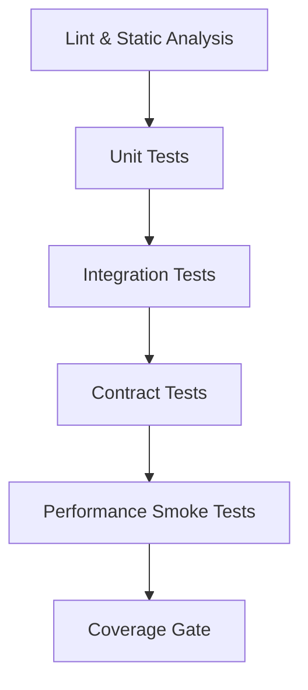

# Continuous Integration (CI) Test Strategy

To prevent regressions and ensure code quality, all pull requests must pass the following CI pipeline stages.

## Pipeline Stages Execution Order

### 1. Lint & Static Analysis
- **Goal**: Code style, type hinting, and security scanning.
- **Tools**: `flake8`, `mypy`, `bandit`, `isort`, `black`.
- **Fail Condition**: Any syntax error, formatting mismatch, or type violation.

### 2. Unit Tests
- **Goal**: Fast verification of isolated domain logic (Evaluator, SDK engine).
- **Tools**: `pytest tests/domain sdk/tests`
- **Fail Condition**: Any failing assertion. Must execute in < 10 seconds.

### 3. Integration Tests
- **Goal**: Verification of cross-component interactions using real infrastructure.
- **Tools**: `docker-compose -f docker-compose.test.yml up -d`, `pytest tests/infrastructure tests/e2e`
- **Fail Condition**: Any failing assertion regarding Redis caching, Kafka outbox publishing, or HTTP API workflows.

### 4. Contract Tests
- **Goal**: Ensuring producers and consumers of data structures don't drift.
- **Tools**: `pytest tests/contracts`
- **Fail Condition**: Schema mismatches on SDK Snapshot definitions or Kafka event payloads.

### 5. Performance Smoke Tests
- **Goal**: Ensuring no catastrophic performance degradation occurred (e.g., N+1 query introduction).
- **Tools**: Execution of `tests/performance/load_test.py` with 100 req/s.
- **Fail Condition**: Average latency exceeds 200ms or Error Rate > 0%.

### 6. Coverage Gate
- **Goal**: Prevent the merging of untested features.
- **Tools**: `pytest-cov` generating the final report.
- **Fail Condition**: Coverage of `app/domain` drops below 95%, or overall coverage drops below 85%.

This strategy guarantees high confidence on every merge to the `main` branch.
