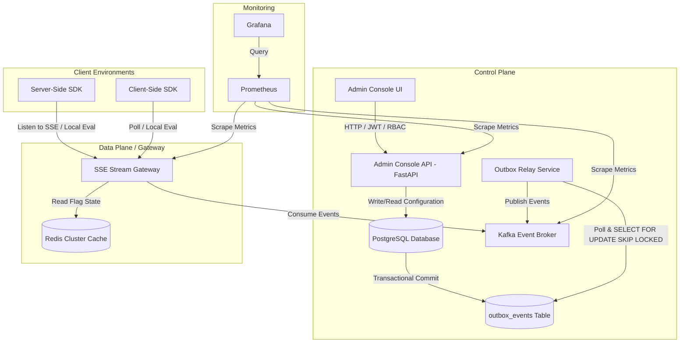
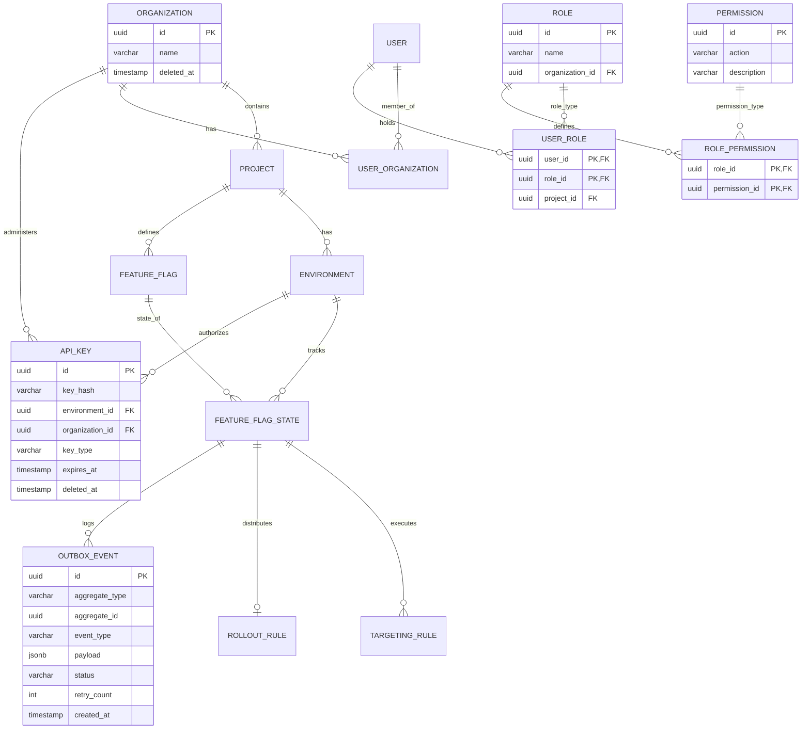

# Implementation Plan: Distributed Feature Flag Platform System Design (Revised Phase 0)

This document contains the complete and revised Phase 0 System Design and Architecture for our production-grade multi-tenant Distributed Feature Flag Platform. It incorporates revisions for API contracts, role-based access controls, outbox pattern pipelines, caching, and resilience strategies.

---

## User Review Required

> [!IMPORTANT]
> Please review the revised architecture design covering the newly introduced API contracts, the transactional Outbox Pattern for event delivery guarantees, the versioned cache invalidation script, and the soft-delete composite index structure.

## Open Questions

> [!NOTE]
> All primary architectural decisions are now specified in this design. Please verify the rate limits and API response schemas for compatibility with your target SDK platforms.

---

## SECTION 1: Product Requirements Document (PRD)

### Functional Requirements
1. **Multi-Tenant Isolation**: Complete isolation of resources (projects, environments, flags, API keys, and audit logs) per Tenant (Organization).
2. **Resource Hierarchy**: Organization -> Projects -> Environments (e.g., Development, Staging, Production).
3. **Feature Flag CRUD & Lifecycle**: Allow creation, editing, deletion, archiving, and cloning of flags across environments. Supports a **Soft-Delete Strategy** to preserve audit trails.
4. **Targeting Rule Engine**: Support serving specific variations based on user attributes (e.g., country, email, user_type) matching operators (equals, not_equals, contains, in, regex).
5. **Percentage Rollouts**: Split traffic deterministically across variations (e.g., 10% Gold, 90% Silver) based on a persistent attribute (e.g., `user_id`).
6. **Enable/Disable Flags**: Toggle flags on or off instantly across environments.
7. **Audit Logging**: Track all configuration changes showing who, what, when, and the before/after state diff.
8. **RBAC**: Multi-tiered access control (Owner, Admin, Writer, Reader) utilizing Role, Permission, UserRole, and RolePermission tables.
9. **API Key Authentication**: Issue read-only SDK keys and read-write Admin keys scoped by Environment.
10. **SDK-Based Evaluation**: Real-time evaluation of feature flags directly in client code with sub-millisecond local execution.

### Non-Functional Requirements
1. **Low Latency**: Local SDK evaluations must take `< 1ms`. Streaming updates must reach active SDKs globally within `2 seconds` of an admin toggle.
2. **High Availability**: 
   - Write path (Admin Console): `99.9%` uptime.
   - Read path (SDK evaluations): `99.999%` uptime. The architecture must tolerate total database or Redis failure; SDKs must run on local cache or defaults.
3. **High Throughput**: Capable of handling hundreds of thousands of persistent SDK connections and millions of evaluation events per second.
4. **Data Consistency**: Eventual consistency is accepted for the SDK update loop (target propagation delay < 2 seconds) driven by outbox propagation. Strict consistency is required for the Control Plane.

---

## SECTION 2: System Design Goals

### Scalability Goals
- **Control Plane vs. Data Plane Separation**: Decouple Admin Console actions (writes to PostgreSQL) from the SDK stream gateway (reads from Redis/SSE).
- **Outbox Pattern for Reliable Propagation**: Guarantee that any flag change committed to the database is eventually published to Kafka without relying on double-writes.

### Consistency Requirements
- **Write Consistency**: Control plane updates must use strong ACID transactions in PostgreSQL.
- **Cache Consistency**: Use versioned Lua scripts in Redis to prevent out-of-order event delivery from overwriting newer cache entries.

### Security Requirements
- **Distributed Rate Limiting**: Limit API abuses at both the Admin API layer and SDK Gateway layer via Redis-backed token bucket limits.

---

## SECTION 3: High-Level Architecture (HLD)

### Component Diagram



### Outbox Pattern Pipeline
To guarantee database and Kafka consistency:
1. **DB Transaction**: When an admin alters a flag, the database transaction updates the `feature_flag_state` table and simultaneously inserts a row into `outbox_events` containing the serialized state.
2. **Outbox Relay**: An independent service polls the `outbox_events` table periodically (every 100ms) or tails the Postgres Write-Ahead Log (WAL).
3. **Kafka Publish**: The relay publishes events to Kafka. Upon confirmation of receipt from Kafka, the relay updates the status of the outbox event in the database to `processed` (or purges the row).

---

## SECTION 4: Low-Level Architecture (LLD)

### Modules Design

#### 1. Authentication & RBAC Module
- **Responsibilities**:
  - Decodes and validates JWT tokens.
  - Resolves role and permission mappings for the active user session.
  - Matches API keys against SHA-256 database hashes.
- **Dependencies**: Database.

#### 2. Feature Flag Management Module
- **Responsibilities**:
  - Manages flag lifecycle (CRUD, toggle, archiving).
  - Handles soft-deletion by setting `deleted_at` timestamps instead of issuing raw SQL `DELETE` calls.
- **Dependencies**: Database, Outbox Relay.

#### 3. Outbox Relay Service
- **Responsibilities**:
  - Polls `outbox_events` with concurrency safety using `SELECT FOR UPDATE SKIP LOCKED`.
  - Publishes events to Kafka.
  - Handles Kafka backpressure and connection failure retries.
- **Dependencies**: Database, Kafka Producer.

#### 4. Distributed Rate Limiter
- **Responsibilities**:
  - Inspects incoming requests by IP or API Key against sliding window configurations in Redis.
- **Dependencies**: Redis.

---

## SECTION 5: Domain Model

### 1. User
- `id`: UUID (Primary Key)
- `email`: VARCHAR(255) (Unique, Indexed)
- `password_hash`: VARCHAR(255)
- `is_active`: BOOLEAN
- `created_at`: TIMESTAMP
- `updated_at`: TIMESTAMP

### 2. Role
- `id`: UUID (Primary Key)
- `name`: VARCHAR(100) (e.g., `Admin`, `Editor`, `Viewer`)
- `organization_id`: UUID (Foreign Key -> Organization, Nullable for system-wide roles)
- `created_at`: TIMESTAMP

### 3. Permission
- `id`: UUID (Primary Key)
- `action`: VARCHAR(100) (e.g., `flag:create`, `flag:toggle`, `project:write`)
- `description`: TEXT

### 4. UserRole (Join Table)
- `user_id`: UUID (Primary Key, Foreign Key -> User)
- `role_id`: UUID (Primary Key, Foreign Key -> Role)
- `project_id`: UUID (Nullable, Scopes role to specific project)

### 5. RolePermission (Join Table)
- `role_id`: UUID (Primary Key, Foreign Key -> Role)
- `permission_id`: UUID (Primary Key, Foreign Key -> Permission)

### 6. Organization
- `id`: UUID (Primary Key)
- `name`: VARCHAR(255)
- `deleted_at`: TIMESTAMP (Nullable)
- `created_at`: TIMESTAMP

### 7. Project
- `id`: UUID (Primary Key)
- `organization_id`: UUID (Foreign Key -> Organization)
- `name`: VARCHAR(255)
- `deleted_at`: TIMESTAMP (Nullable)
- `created_at`: TIMESTAMP

### 8. Environment
- `id`: UUID (Primary Key)
- `project_id`: UUID (Foreign Key -> Project)
- `name`: VARCHAR(100)
- `deleted_at`: TIMESTAMP (Nullable)
- `created_at`: TIMESTAMP

### 9. ApiKey
- `id`: UUID (Primary Key)
- `key_hash`: VARCHAR(64) (SHA-256 hashed value, Unique, Indexed)
- `environment_id`: UUID (Nullable, Foreign Key -> Environment, for SDK Keys)
- `organization_id`: UUID (Nullable, Foreign Key -> Organization, for Admin Keys)
- `key_type`: VARCHAR(50) (e.g., `client_sdk`, `server_sdk`, `admin`)
- `name`: VARCHAR(100)
- `expires_at`: TIMESTAMP (Nullable)
- `deleted_at`: TIMESTAMP (Nullable)
- `created_at`: TIMESTAMP

### 10. FeatureFlag
- `id`: UUID (Primary Key)
- `key`: VARCHAR(100)
- `name`: VARCHAR(255)
- `project_id`: UUID (Foreign Key -> Project)
- `value_type`: VARCHAR(20) (e.g., `boolean`, `string`, `json`)
- `deleted_at`: TIMESTAMP (Nullable)
- `created_at`: TIMESTAMP

### 11. FeatureFlagState
- `id`: UUID (Primary Key)
- `flag_id`: UUID (Foreign Key -> FeatureFlag)
- `environment_id`: UUID (Foreign Key -> Environment)
- `is_enabled`: BOOLEAN
- `version`: INTEGER (Monotonically increments on every change)
- `updated_at`: TIMESTAMP

### 12. OutboxEvent
- `id`: UUID (Primary Key)
- `aggregate_type`: VARCHAR(100)
- `aggregate_id`: UUID
- `event_type`: VARCHAR(100)
- `payload`: JSONB
- `status`: VARCHAR(20) (e.g., `pending`, `processed`, `failed`)
- `retry_count`: INTEGER (Default 0)
- `error_message`: TEXT (Nullable)
- `created_at`: TIMESTAMP

---

## SECTION 6: Database Design

### ER Diagram



### Soft-Delete Strategy
To support soft-deletion without breaking unique keys (e.g. recreating a flag with the same key after deleting it):
- Implement a `deleted_at` timestamp.
- Establish partial unique indexes in PostgreSQL.
- **SQL Example**:
  ```sql
  CREATE UNIQUE INDEX idx_flag_key_active ON feature_flag (project_id, key) WHERE deleted_at IS NULL;
  CREATE UNIQUE INDEX idx_api_key_active ON api_key (key_hash) WHERE deleted_at IS NULL;
  ```
- All standard app queries default to adding a `WHERE deleted_at IS NULL` predicate.

---

## SECTION 7: Feature Flag Evaluation Design

### Evaluation Response Schema with Metadata
When requesting evaluations (either from the server endpoint or calculated by the local SDK engine), the output must conform to this schema:

```json
{
  "flag_key": "new_checkout_flow",
  "value": "variation_treatment",
  "is_default": false,
  "reason": "TARGETING_RULE_MATCH",
  "rule_id": "8bc92d13-0941-477d-bb4a-679df012cc4b",
  "eval_timestamp": "2026-06-05T07:18:47Z",
  "version": 42
}
```

#### Reason Matrix
- `DEFAULT`: Served because the flag is disabled or no rule condition matched.
- `DISABLED`: Served the `default_off_value` directly because the flag `is_enabled` is set to false.
- `TARGETING_MATCH`: Matches a custom user targeting rule priority.
- `PERCENTAGE_ROLLOUT`: Handled via hashing matching percentage bucket boundaries.

---

## SECTION 8: Percentage Rollout Design

Deterministic percentage rollouts map target users consistently:
- **Salt formulation**: `Base Key = user_id + ":" + flag_key + ":" + flag_state_version`
- **Hash calculation**: 
  $$\text{bucket} = \text{MurmurHash3}(\text{BaseKey}) \pmod{10000}$$
- Users fall into ranges `[0, weight_a * 100 - 1]`, `[weight_a * 100, (weight_a + weight_b) * 100 - 1]`, etc.

---

## SECTION 9: Targeting Rule Engine

Uses the **Strategy** and **Specification** patterns to evaluate targeting rules matching attributes like country, subscription plan, or custom values using operators (`equals`, `not_equals`, `contains`, `in`, `regex`).

---

## SECTION 10: Redis Strategy

### Versioned Cache Strategy
To protect against race conditions where Kafka messages are delivered out-of-order (e.g., an older update event overwrite), Redis writes utilize a versioned validation logic via Lua scripts.

- **Redis Key Structure**:
  - Cache Hash: `env:{env_id}:flags` (maps `flag_key` to config payload).
  - Version Key: `env:{env_id}:version` (tracks maximum version processed).

- **Lua script for Atomic Versioned Updates**:
  ```lua
  local key = KEYS[1]
  local field = ARGV[1]
  local payload = ARGV[2]
  local new_version = tonumber(ARGV[3])

  local current_data = redis.call('HGET', key, field)
  if current_data then
      local current_json = cjson.decode(current_data)
      local current_version = tonumber(current_json['version'])
      if new_version > current_version then
          redis.call('HSET', key, field, payload)
          return 1
      else
          return 0
      end
  else
      redis.call('HSET', key, field, payload)
      return 1
  end
  ```

---

## SECTION 11: Kafka Design

### Redesigned Topics

1. **`cdc.flag-updates`**:
   - **Producer**: Outbox Relay Service.
   - **Consumer**: SSE Stream Gateways, Redis Cache Invalidator.
   - **Partition Key**: `environment_id` (guarantees ordered flag evaluations for a given environment).
   - **Compaction**: Enabled (Log Compaction) to keep disk footprint optimized while retaining final flag states.

2. **`sdk.metrics-raw`**:
   - **Producer**: Stream Gateways (receiving batch metrics from SDKs).
   - **Consumer**: Analytics Aggregator.
   - **Partition Key**: `flag_key`.

---

## SECTION 12: Security & Rate-Limiting Design

### Distributed Rate Limiting
To prevent abuse, we implement a distributed **Token Bucket** algorithm in Redis.

- **Limits Matrix**:
  - SDK Bootstrap: 100 req/sec per Client IP.
  - SDK SSE Connections: 20 handshakes/min per Client IP.
  - Admin APIs: 5 req/sec per User JWT token.

- **Lua Script Implementation**:
  ```lua
  local key = KEYS[1]
  local limit = tonumber(ARGV[1])
  local capacity = tonumber(ARGV[2])
  local now = tonumber(ARGV[3])
  local cost = tonumber(ARGV[4] or 1)

  local state = redis.call('HMGET', key, 'tokens', 'last_update')
  local tokens = tonumber(state[1])
  local last_update = tonumber(state[2])

  if not tokens then
      tokens = capacity
      last_update = now
  else
      local delta = math.max(0, (now - last_update) * limit)
      tokens = math.min(capacity, tokens + delta)
  end

  if tokens >= cost then
      tokens = tokens - cost
      redis.call('HMSET', key, 'tokens', tokens, 'last_update', now)
      redis.call('EXPIRE', key, 60)
      return 1
  else
      return 0
  end
  ```

---

## SECTION 13: SDK Architecture (Python Client Design)

### Expanded Bootstrap Architecture

```mermaid
stateDiagram-v2
    [*] --> Initialization
    
    state Initialization {
        [*] --> CheckLocalBootstrap
        CheckLocalBootstrap --> LoadLocalFile : Bootstrap file exists
        CheckLocalBootstrap --> FetchFromCDN : No Bootstrap file
        LoadLocalFile --> WarmMemoryCache
        FetchFromCDN --> WarmMemoryCache
    }

    WarmMemoryCache --> StreamConnection : Initial cache ready
    
    state StreamConnection {
        [*] --> EstablishSSE
        EstablishSSE --> ProcessEvents : Connected
        EstablishSSE --> HandleDisconnect : Connection Failed / Dropped
        HandleDisconnect --> OfflineFallback : Offline timeout reached
        HandleDisconnect --> RetryBackoff : Exponential Backoff
        RetryBackoff --> EstablishSSE
    }

    ProcessEvents --> WarmMemoryCache : Update received
```



1. **Local Bootstrap Initialization**:
   - On instantiation, the SDK checks for a locally provided configuration file payload (compiled from a previous run or static asset). If found, it immediately loads configurations into memory to minimize initial launch latency.
2. **Network Bootstrapping**:
   - If no local bootstrap is available, it queries the gateway boot endpoint `POST /api/v1/sdk/bootstrap` requesting compression (`Accept-Encoding: gzip`).
3. **SSE Connection & Offline Fallback**:
   - Once memory is warmed, the SDK starts a background connection thread to the gateway's SSE stream.
   - If the gateway becomes unreachable, the SDK continues serving evaluations from its memory cache. If the client experiences cold startup without network access, the SDK returns the developer's default values and triggers fallback hooks.

---

## SECTION 14: Observability Design

Metrics are exposed via Prometheus `/metrics` endpoint capturing evaluation volumes, cache health, and gateway connection loads.

---

## SECTION 15: Clean Architecture Folder Structure

```
distributed-feature-flags/
├── alembic/
├── app/
│   ├── main.py
│   ├── domain/
│   │   ├── entities/             # User, Role, Permission, ApiKey, OutboxEvent
│   │   └── value_objects.py
│   ├── application/
│   │   ├── use_cases/            # EvaluateFlag, CreateFlag, ProcessOutbox
│   │   └── interfaces/
│   ├── infrastructure/
│   │   ├── db/                   # SQLAlchemy with RLS session configurations
│   │   ├── cache/                # Redis client with Lua rate limiter/version script
│   │   └── messaging/            # Kafka producers/consumers
│   └── presentation/
│       ├── api/                  # FastAPI routers (Admin, SDK endpoints)
│       └── middleware/           # RateLimitMiddleware, TenantIsolationMiddleware
└── tests/
```

---

## SECTION 16: Implementation Roadmap

Revised timeline incorporating Outbox and RBAC revisions:
- **Phase 1**: Project Setup & RLS Config.
- **Phase 2**: Authentication & Detailed RBAC models.
- **Phase 3**: Tenant Isolation, Outbox Table, and Soft-Deletes.
- **Phase 4**: Rule & Percentage Hashing Engine.
- **Phase 5**: Outbox Relay Worker & Kafka Topic Initialization.
- **Phase 6**: Redis Rate Limiting & Versioned Cache Script.
- **Phase 7**: SDK Bootstrapping & SSE Stream Gateway.
- **Phase 8**: Production hardening and verification tests.

---

## SECTION 17: API Contract Specification

### 1. Authentication & Scope Management

#### POST `/api/v1/auth/login`
- **Description**: Authenticate admin/engineer dashboard user.
- **Headers**:
  - `Content-Type: application/json`
- **Request Body**:
  ```json
  {
    "email": "user@organization.com",
    "password": "secure_password"
  }
  ```
- **Responses**:
  - `200 OK`:
    ```json
    {
      "access_token": "jwt_token_here",
      "refresh_token": "refresh_token_here",
      "token_type": "bearer",
      "expires_in": 900
    }
    ```
  - `401 Unauthorized`: Invalid credentials.

---

### 2. Feature Flag Control Panel

#### POST `/api/v1/projects/{project_id}/flags`
- **Description**: Create a new feature flag configuration.
- **Headers**:
  - `Authorization: Bearer <JWT>`
  - `X-Tenant-ID: <org_uuid>`
- **Request Body**:
  ```json
  {
    "key": "new_checkout_flow",
    "name": "New Checkout Design",
    "value_type": "boolean",
    "default_on_value": "true",
    "default_off_value": "false"
  }
  ```
- **Responses**:
  - `201 Created`: Flag metadata object created.
  - `409 Conflict`: Key already exists (and is not soft-deleted).

#### PATCH `/api/v1/projects/{project_id}/flags/{flag_key}/state`
- **Description**: Update rules, target configuration, or toggle status of an active flag.
- **Headers**:
  - `Authorization: Bearer <JWT>`
  - `X-Tenant-ID: <org_uuid>`
- **Request Body**:
  ```json
  {
    "is_enabled": true,
    "targeting_rules": [
      {
        "attribute": "country",
        "operator": "in",
        "values": ["IN", "SG"],
        "value_to_serve": "true",
        "priority": 1
      }
    ],
    "rollout_rule": {
      "bucket_by": "user_id",
      "variations": [
        {"value": "true", "weight": 50},
        {"value": "false", "weight": 50}
      ]
    }
  }
  ```
- **Responses**:
  - `200 OK`: State updated, version incremented, outbox record created.

#### DELETE `/api/v1/projects/{project_id}/flags/{flag_key}`
- **Description**: Soft-delete a feature flag.
- **Headers**:
  - `Authorization: Bearer <JWT>`
  - `X-Tenant-ID: <org_uuid>`
- **Responses**:
  - `204 No Content`: Flag marked as deleted.

---

### 3. SDK Endpoints

#### GET `/api/v1/sdk/bootstrap`
- **Description**: Bootstraps the SDK local environment state config map.
- **Headers**:
  - `Authorization: Bearer <SDK_Key>`
  - `Accept-Encoding: gzip`
- **Responses**:
  - `200 OK`:
    ```json
    {
      "environment_name": "Production",
      "version": 108,
      "flags": {
        "new_checkout_flow": {
          "is_enabled": true,
          "value_type": "boolean",
          "default_on_value": "true",
          "default_off_value": "false",
          "targeting_rules": [
            {
              "id": "rule_1",
              "attribute": "country",
              "operator": "in",
              "values": ["IN", "SG"],
              "value_to_serve": "true",
              "priority": 1
            }
          ],
          "rollout_rule": {
            "bucket_by": "user_id",
            "variations": [
              {"value": "true", "weight": 50},
              {"value": "false", "weight": 50}
            ]
          },
          "version": 42
        }
      }
    }
    ```

#### GET `/api/v1/sdk/stream`
- **Description**: Persistent SSE streaming channel endpoint to push real-time changes to SDKs.
- **Headers**:
  - `Authorization: Bearer <SDK_Key>`
  - `Accept: text/event-stream`
- **Stream Event Payload**:
  ```event: flag_update
  data: {
    "environment_version": 109,
    "updated_flags": {
      "new_checkout_flow": {
        "is_enabled": false,
        "version": 43
      }
    }
  }
  ```
